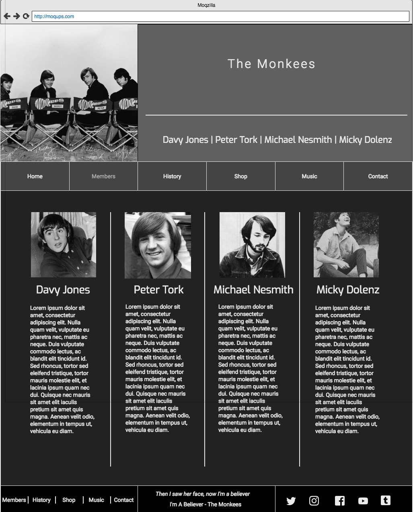
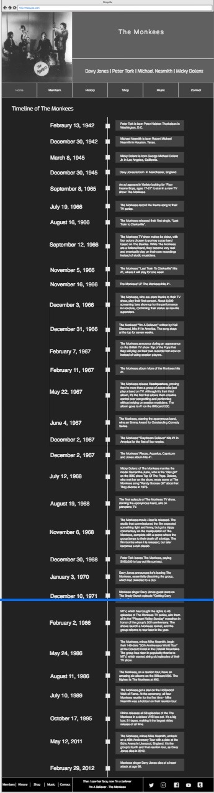
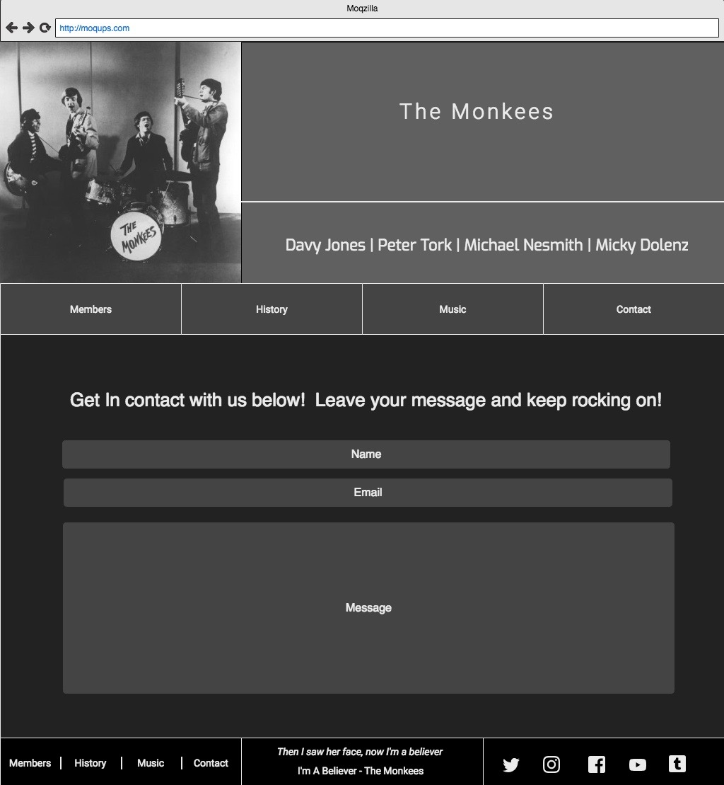
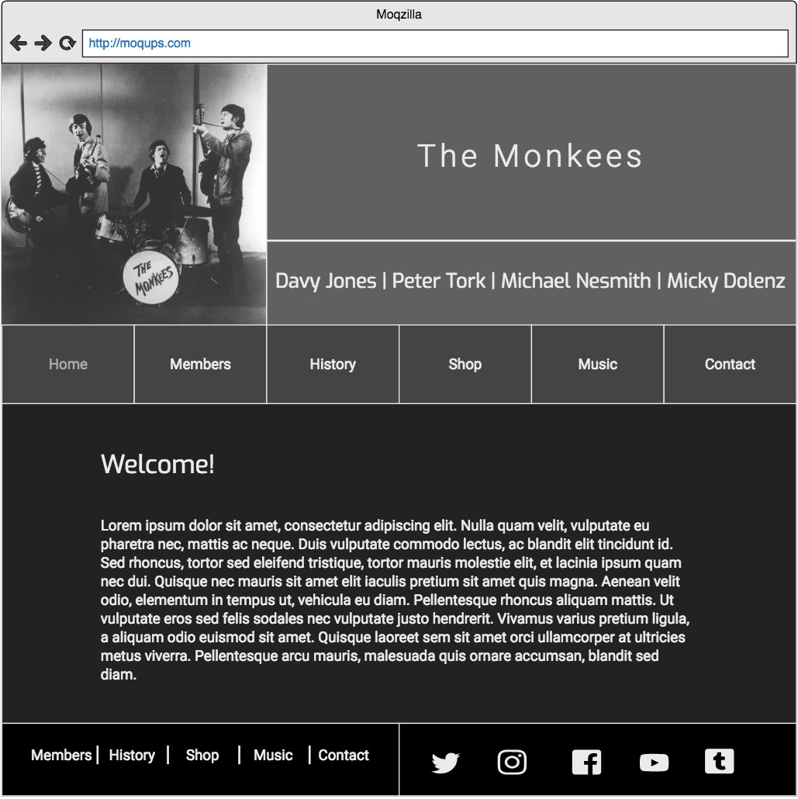
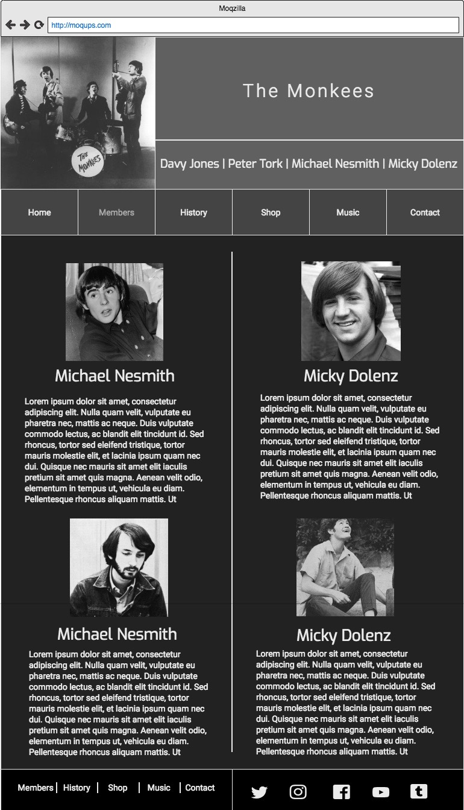
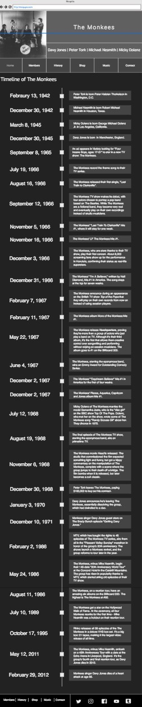
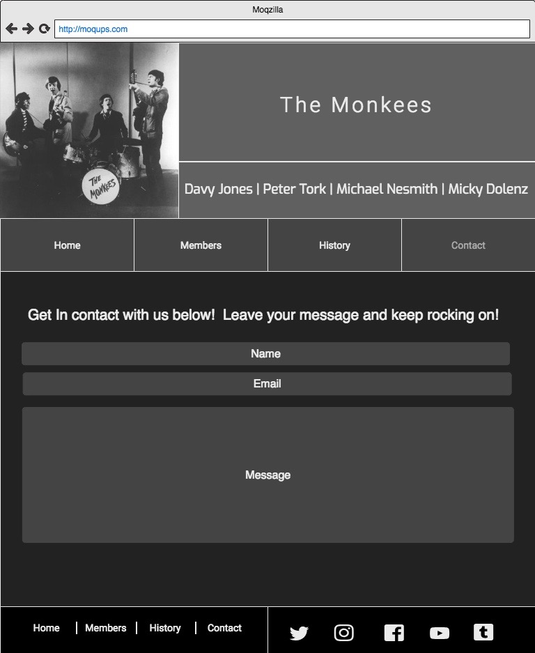
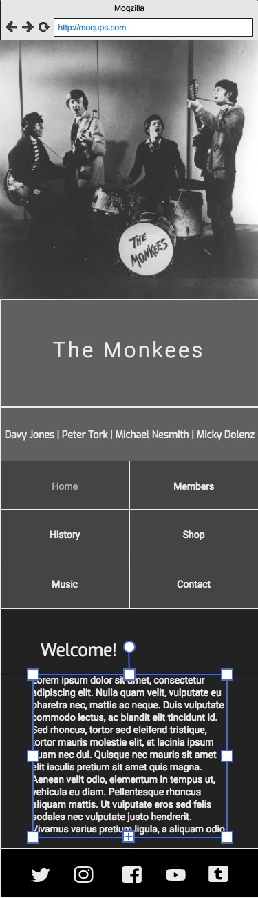
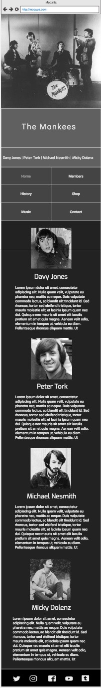
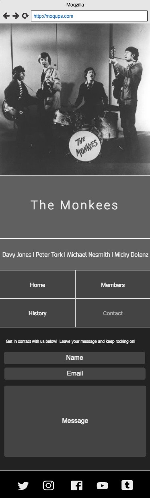

# User Centric Front End Development Milestone Project - The Monkees

A four page website about *The Monkees* using HTML and CSS.

## Requirements

Before I began to plan the website, I started thinking about what content I would
like to include. A welcome page for making the user feel that they are in a friendly
environment, links to the bands social accounts, brief descriiption of each of the
band members, a brief history about the band and a contact form to submit a message.

## Design

To plan the website, I used a website called moqups.  Moqups is a wireframing
web application that helps in the designing of websites. Once I decided that I
wanted the website to be about the monkees, I started thinking about color
schemes and fonts. I ended up going with a black and white simplistic but clean
and functional website. Below are the plans I made on moqups.

### These are the original plans for the desktop site.

Home Page - Desktop

Members Page - Desktop

History Page - Desktop

Contact Page - Desktop

### These are the original plans for the tablet site.

Home Page - Tablet

Members Page - Tablet

History Page - Tablet

Contact Page - Tablet

### These are the original plans for the mobile site.

Home Page - Mobile

Members Page - Mobile

Contact Page - Mobile

## Implementation

After designing the site, I opened a new project on Cloud9 and a git repository.
I began with index.html and got the head of the document in place as well as the
header, section and footer tags ready to be coded. It was at this point I made
my first commit.     
- [Initial Commit](https://github.com/kevinheywood/the-monkees/commit/e9a74e9a2096ceab9ff922a53ae4f667eff9a526)

Next, I added a style.css page as well as creating the header that will be on each
page. From here I made another commit.     
- [Created the Header](https://github.com/kevinheywood/the-monkees/commit/62f1bfff5da750ff94930b90b7096ef3a2698f85)

The next stage involved me creating the footer as well as making it mobile and tablet
friendly.     
- [Created the Footer](https://github.com/kevinheywood/the-monkees/commit/1fad07113b1ec8fcff34362f69fa66fa93c7d594)

Next I created the home section.  This is a jumbotron with an h2 and two paragraphs     
- [Created the Home Section](https://github.com/kevinheywood/the-monkees/commit/5478db8f60edd51460952bb54e345b67d4c52bad)

I then added members.html and made a commit, followed by adding the header and footer
to the document.     
- [Added members.html](https://github.com/kevinheywood/the-monkees/commit/07c33f99e6376be11ec64e1a2b7eb9b8f695c213)     
- [Added header and footer](https://github.com/kevinheywood/the-monkees/commit/bc313219445c506a1e90496ac845ba8c12c22e5c)

Next, was the members section.  This consisted of an image, an h2 and a paragraph,
nested within a div.  There are four of these nested within another div.
- [Created members section](https://github.com/kevinheywood/the-monkees/commit/88023bbd06f6bbfbd14ff6e7a670e500772946d3)

I then went on to create the history page. I put the header and footer in place and
then began on the section. The section is a timeline going from the 1940s to the
2010s which gives a brief history of the monkees.
- [Added history.html](https://github.com/kevinheywood/the-monkees/commit/934e6a73a7cd79411550cb21c90f52186cdcc3de)     
- [Added header and footer](https://github.com/kevinheywood/the-monkees/commit/8ae75c71f0c409186845f73ac325ef9e76be3564)    
- [Created History Section](https://github.com/kevinheywood/the-monkees/commit/39d39b8c04024a27a61d51f3e17e2921e975cfce)

The last page to be added was the contact page. The contact section is a four peice
form consisting of a name, email address and message boxes as well as a button to
submit.
- [Added contact.html](https://github.com/kevinheywood/the-monkees/commit/727cfaaaf0f6f9edbcac27cbc3c5838b726a79fc)    
- [Added Header and Footer](https://github.com/kevinheywood/the-monkees/commit/2c2fd1cac9f93f1f25a5f6cc14316c4b6d651ae0)   
- [Created Contact Section](https://github.com/kevinheywood/the-monkees/commit/824f09f8f0cffbfb3de254a59bf3dba6a4baab76)

## Testing

To test the website I ran a number of tests. The first being, I would individually click
each link to make sure they all work as well as change the size of the page to make sure
it still looks well and functions on both tablet and mobile. The second test was I ran
each page through Nu Html Checker at validator.w3.org to check for any errors in code that
I may have missed and finally I ran a google chrome audit to see if there were any other
minor improvements to be made. Below are the links to the commits made during the testing
process.     
- [Changed h1 to h2 in home section](https://github.com/kevinheywood/the-monkees/commit/2e301ce7de8c528da71a645d4eaa1ed141c09b2d)     
- [Added description meta tags to all pages](https://github.com/kevinheywood/the-monkees/commit/1f78f377fd1ddd8e865f9ffcc7751d0513ed66de)     
- [Added theme color to all web pages](https://github.com/kevinheywood/the-monkees/commit/cb038bb640276ad0426dead14028209d9ee57f43)     
- [Added heading to contact.html](https://github.com/kevinheywood/the-monkees/commit/10c114b8e75e156994d9c2ec24ee1c3f03b688b5)     
- [Added moqup images for readme](https://github.com/kevinheywood/the-monkees/commit/89be8ef46ced9a2872e74ffd93bab687b332cee4)
- [Updated README.md](https://github.com/kevinheywood/the-monkees/commit/d66c7c32023faec08544eb55aa44f467eff1853a)
- [Updated social links with noopener](https://github.com/kevinheywood/the-monkees/commit/a9245638a67f0afe180d9786fa7455b998206535)

## References and Credits

### Planning

- [moqups](www.moqups.com/) is what I used for planning the site. 

### Implementation

- [google images](https://images.google.com/) is where I got the pictures for the site.     
- [IMDb](https://www.imdb.com/) is where I got the information from about the members.     
- [Songfacts](https://calendar.songfacts.com) is where I got the information for the history page.
- [cloud9](https://c9.io/login) is the software I used to create the website.
- [github](https://github.com) is where I commited my repositories.
- I got my inspiration for some of the site from the resume project by Code Institute.
- I researched how to do a timeline on w3schools for the history section.

### Testing

- Google chrome audits is how I tested my site.   
- [w3 validator](https://validator.w3.org) is another way I tested the site.

### Thanks

I would like to take this oppertunity to thank my mentor, Viktor Miclovich for
giving me advice and help me understand things better.